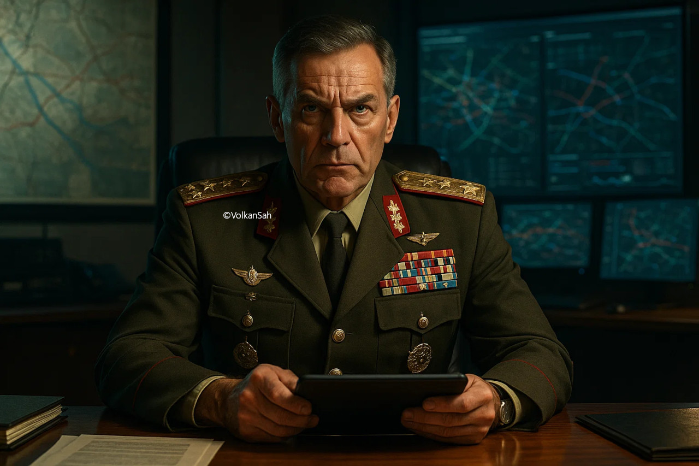

## Command & Conquer Open-Source-Projekte (Post-GPL)
[English briefing](README.md)

*Hinweis: Hero-Porträt für Community-Projekte, General, nur stilistische Referenz.*

# 📝 Mission Briefing: C&C Open-Source Operation

**Sarge — Einsatzbefehl eingegangen.**  
Start: **27. Februar 2025, 08:00 Uhr**  
Ende: ungewiss (evtl. tödlich)  
Ort: **Community Operations – C&C Open-Source Front**

**Befehlshaberin:** Kommandantin Tanya — streng, befehlshabend.
*Notiz: Code ist sexy & hart. Keine Diskussionen. Bitte vertraulich behandeln, Sarge.*
---

*Hinweis: Hero-Porträt für Community-Projekte, Tanya, nur stilistische Referenz. Sie leitet das Briefing.*

📑 Briefing mit Tanja 

1. [I. Projekte auf Basis der Remastered-Cores](#i-projekte-auf-basis-der-remastered-cores-tiberian-dawn--red-alert-1)
2. [II. Open-Source Engine-Reimplementierungen](#ii-open-source-engine-reimplementierungen-vor-und-nach-gpl)
3. [III. Projekte auf Basis der später freigegebenen Cores](#iii-projekte-auf-basis-der-später-freigegebenen-cores-generals--renegade)
   - [A. Generals/Zero Hour (SAGE-Engine)](#a-generalszero-hour-sage-engine)
   - [B. Renegade (W3D-Engine)](#b-renegade-w3d-engine)
4. [Entwickler-Hinweise: Assets & FOSS-Ziel](#entwickler-hinweise-assets--foss-ziel)
5. [Community-Tipps & Modding-Tools](#community-tipps--modding-tools)
6. [Best Practices](#best-practices)

---

## I. Projekte auf Basis der Remastered-Cores (Tiberian Dawn & Red Alert 1)

| Projekt                            | Beschreibung                                                                                                             | Link                                                                   |
| :--------------------------------- | :----------------------------------------------------------------------------------------------------------------------- | :--------------------------------------------------------------------- |
| **C&C Remastered Collection Mods** | Viele Community-Mods: Balance, neue Einheiten, Kampagnen.                                                               | [C&C Modding Discord](https://discord.gg/commandandconquer)            |
| **OpenC&C** (Konzept)              | Plattformunabhängige Neuimplementierung. *(Noch in Konzeptphase)*                                                       | [GitHub OpenC&C](https://github.com/electronicarts)                    |

Tanya: „Diese alten Kerne sind robust – pimpt sie clever, sonst schickt euch der Feind nach Hause.“  
[ ] Check: Testet zuerst die Engine, dann Mods, nicht alles auf einmal.  

---

## II. Open-Source Engine-Reimplementierungen (vor und nach GPL)

| Projekt    | Beschreibung                                                                                                                                                      | Link                                  |
| :--------- | :---------------------------------------------------------------------------------------------------------------------------------------------------------------- | :------------------------------------ |
| **OpenRA** | Reimplementierung für Red Alert, Tiberian Dawn & Dune 2000.                                                                                                       | [openra.net](https://www.openra.net/) |
| **CnCNet** | Online-Multiplayer-Plattform für klassische C&C-Titel.                                                                                                           | [cncnet.org](https://cncnet.org/)     |

Tanya: „OpenRA & CnCNet = zuverlässige Waffen. Nutzt sie, sonst gibt’s Ärger!“  
[ ] Check: Multiplayer vorher in Low-Res testen, um Zeit & Ressourcen zu sparen.  

---

## III. Projekte auf Basis der später freigegebenen Cores (Generals & Renegade)

### A. Generals/Zero Hour (SAGE-Engine)

| Projekt                         | Beschreibung                                                                            | Link                                                                        |
| :------------------------------ | :-------------------------------------------------------------------------------------- | :-------------------------------------------------------------------------- |
| **Generals/ZH Community Patch** | Früher nur Mod, jetzt auf Engine-Ebene verbessert: Lags, Desyncs, Balance.             | [GitHub: Generals/ZH Source](https://github.com/electronicarts)             |
| **SAGE Engine Modernisierung**  | 4K, FPS, 64-Bit.                                                                       | [C&C Modding Discord / Reddit](https://www.reddit.com/r/commandandconquer/) |

Tanya: „SAGE-Engine ist euer Schlachtfeld – Bugs pulverisieren, FPS hochschrauben!“  
[ ] Check: Testet Änderungen in kleinen Schritten.  

### B. Renegade (W3D-Engine)

| Projekt             | Beschreibung                                                                                                                  | Link                                  |
| :------------------ | :---------------------------------------------------------------------------------------------------------------------------- | :------------------------------------ |
| **W3DHub Projekte** | Dachorganisation für Mod-Projekte.                                                                                             | [w3dhub.com](https://www.w3dhub.com/) |

Tanya: „Renegade X & Co – nutzt den GPL-Core, dann wird’s richtig stark.“  
[ ] Check: Alle Modding-Tools dokumentieren, Lizenz prüfen.  

---

## Entwickler-Hinweise: Assets & FOSS-Ziel

| Zustand                       | Code  | Assets          | Legalität                         |
| :---------------------------- | :---- | :-------------- | :-------------------------------- |
| Original-Assets genutzt       | GPLv3 | Proprietär      | ❌ Nur mit Spielkauf legal         |
| Eigene Assets / CC-lizenziert | GPLv3 | Neu/Open-Source | ✅ Vollwertiges FOSS-Spiel möglich |

Tanya: „Code ist frei, Assets? Keine Cheats! Eigene Kreation = Sieg.“  
[ ] Check: Alle proprietären Assets ersetzen → echtes FOSS-Projekt.  

---

## Community-Tipps & Modding-Tools

| Tool / Ressource           | Beschreibung                                            | Link                                                               |
| :------------------------- | :------------------------------------------------------ | :----------------------------------------------------------------- |
| **OpenRA Map Editor**      | Karten erstellen & testen                               | [openra.net/maps](https://www.openra.net/maps/)                    |
| **CnCNet Lobby / Clients** | Multiplayer testen, Patches & Mods online nutzen        | [cncnet.org/downloads](https://cncnet.org/downloads)               |
| **SAGE Modding Tools**     | Tools für Generals & Zero Hour Modding                  | [r/commandandconquer](https://www.reddit.com/r/commandandconquer/) |
| **W3DHub Tools**           | Renegade Modding & Level-Editoren                       | [w3dhub.com/tools](https://www.w3dhub.com/tools)                   |
| **Community Asset Packs**  | CC0- oder selbst erstellte Assets                       | [OpenGameArt.org](https://opengameart.org/)                        |

Tanya: „Wenn ihr meine Tools ignoriert, gibts morgen Extra-Drill. Macht’s sauber!“  

---

## Best Practices

1. Engine → Assets → Szenen testen.  
2. Safe Prompts für Tanya: subtil, Blick + Pose, Schmutz & Schweiß, keine Erotik.  
3. Low-Res Tests sparen Credits & Renderzeit.  
4. Jede Mod sauber dokumentieren, Links & Lizenz klar angeben.  

Tanya: „Keine Ausreden, Mods perfektionieren, Community stolz machen – los geht’s!“

